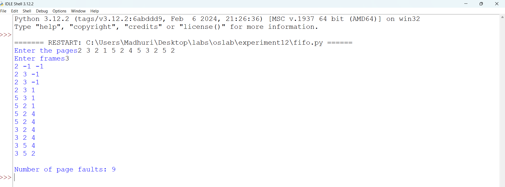
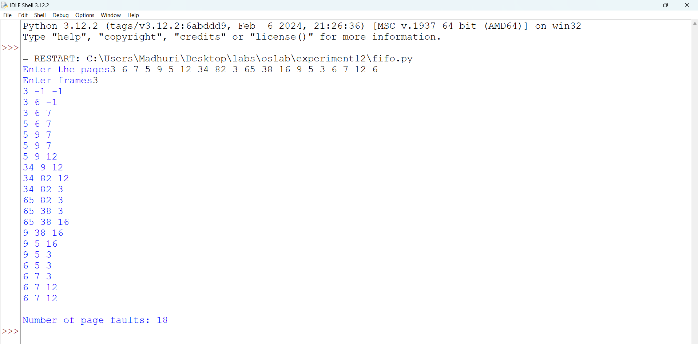
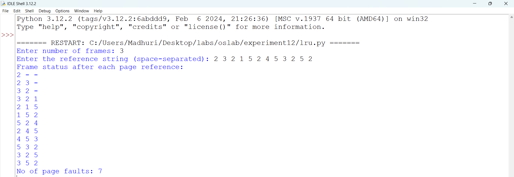
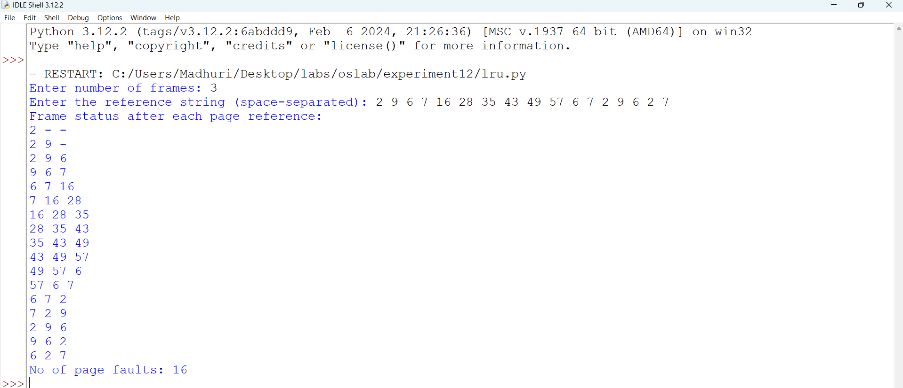
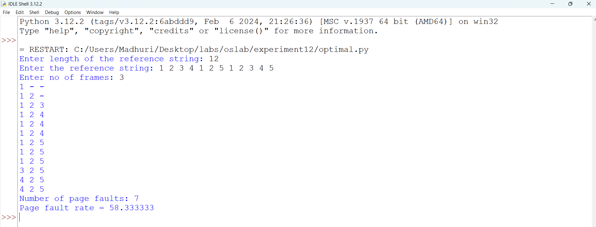
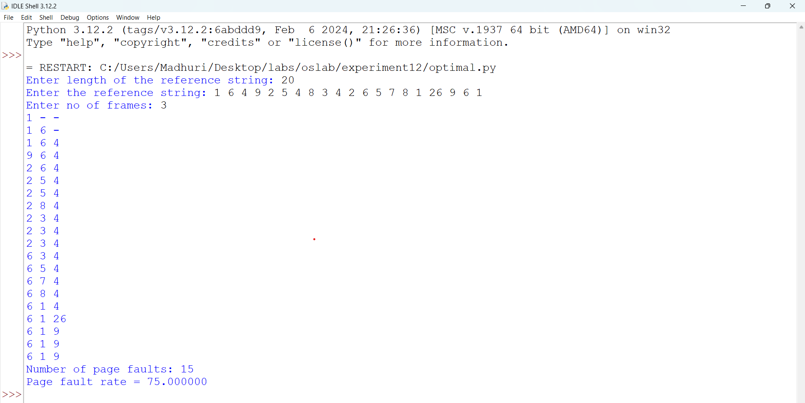

# fifo program file

# fifo sample output

# fifo executed output

# lru program file

# lru sample output

# lru executed output

# optimal program file

# optimal sample output

# optimal executed output

