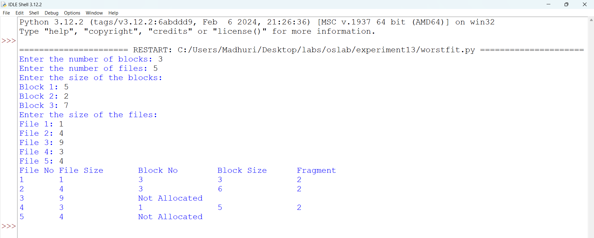
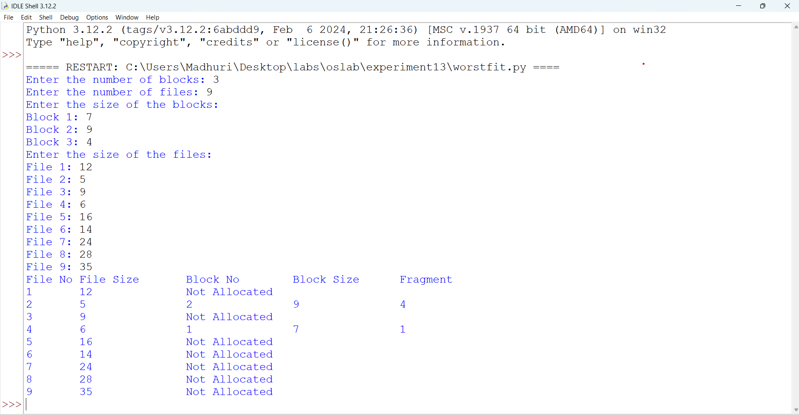
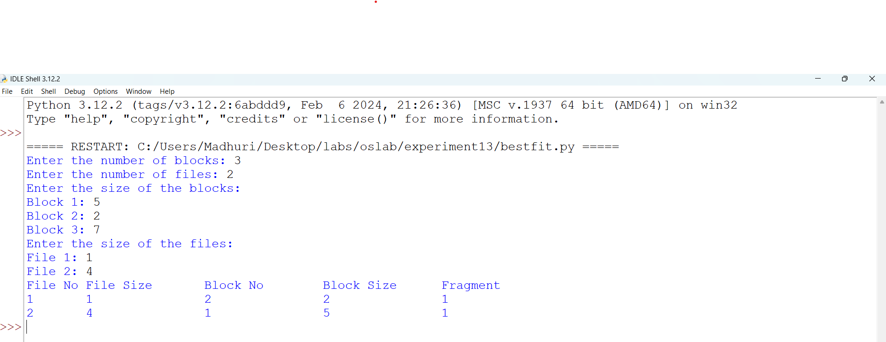
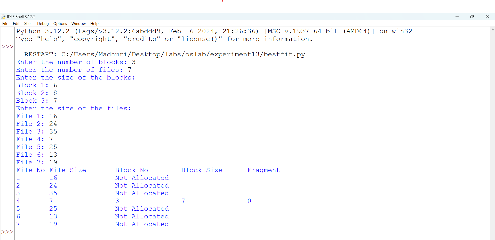
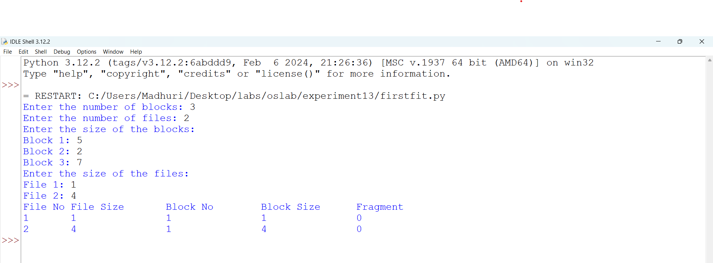
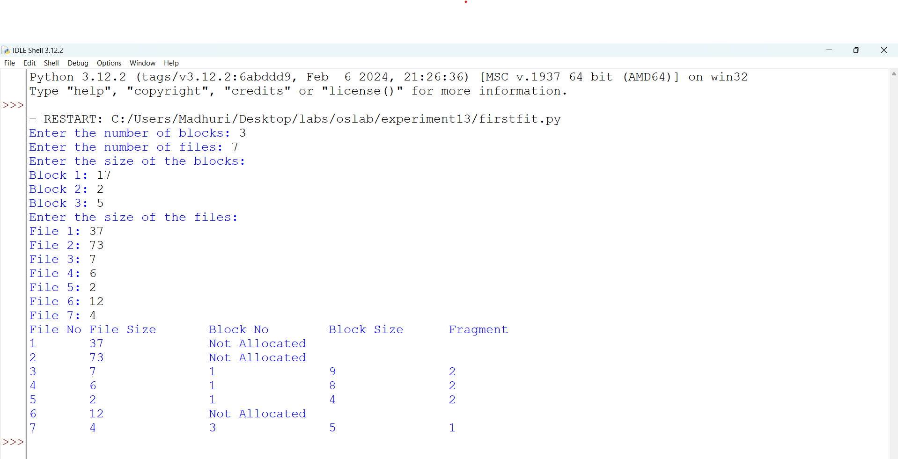

# worst fit program file

# worst fit sample output

# worst fit executed output

# best fit program file

# best fit sample output

# best fit executed output

# first fit program file

# first fit sample output

# first fit executed output

