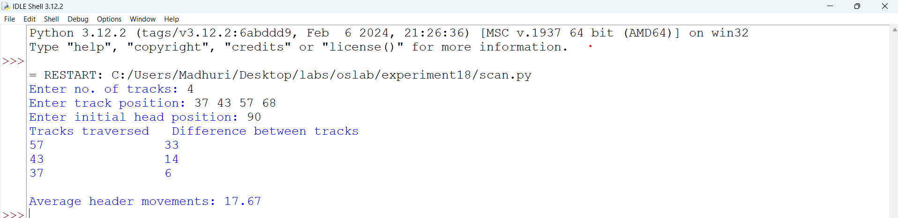
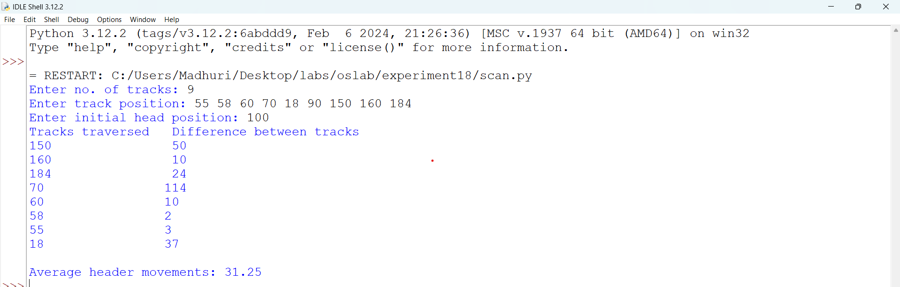
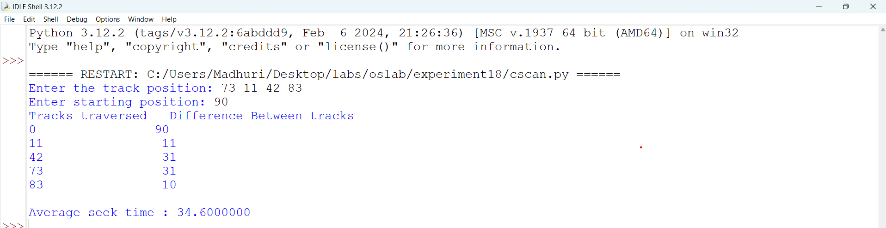
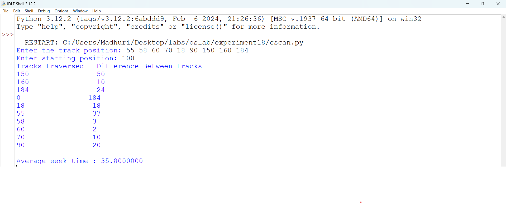

# fcfs program file
.py)

#sample output
_sample_op.png)

#executed output
_executed_op.png)

# scan program file

#sample output

#executed output

# cscan program file

#sample output

#executed output

